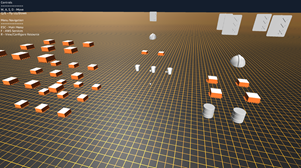
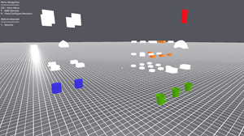
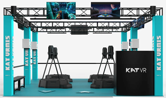

# Frequently Asked Questions (FAQ)

1. What is CHLOE?

    CHLOE is a training simulation that teaches players how to build and visualize AWS workloads in 3D space. Using traditional first-person video game controls, players are exposed to a 3D representation of an AWS account.

    CHLOE includes an expandable set of game levels that introduce the player to core AWS services, workloads, and the AWS Well-Architected Framework through a cohesive storyline. In the story, the player is trapped inside an empty AWS account due to an accident at their company's data center. To return home, the player must optimize and rebuild their company's IT infrastructure in the AWS Cloud. As the player completes levels, they are trained on various products and services, and given additional learning resources for later consumption. Players ultimately beat the game by collecting the AWS Well-Architected Pillars and defeating the main antagonist, [Chaos Monkey](https://netflix.github.io/chaosmonkey/) (a virtual representation of [Chaos Engineering](https://principlesofchaos.org/) at work).

    In Simulation Mode, players can connect to one or more AWS accounts using federation or AWS Identity and Access Management (IAM) credentials. Once connected, players may view and configure workloads in real time, with the changes reflected in their linked accounts. AWS resources can be instantiated, modified, or removed to build workloads of any fashion. Players can activate multiple camera overlays to visualize performance, cost, reliability, security, and other status information based on the Well-Architected Framework. Players can also troubleshoot resource configuration problems, investigate cost reduction opportunities, and learn how to optimize infrastructure in a visual, intuitive manner. If players do not wish to connect CHLOE to their account, they can use Simulation Mode to create 3D architecture diagrams for reference and decision-making.

    CHLOE provides just-in-time (JIT) training, giving access to the right information exactly when a player needs it: while actively building. Using an in-game assistant named CHLOE, players can get contextual advice and information related to specific tasks they are performing. Players can request information in the form of audio or text explanations, streaming video, or in-game architecture demonstrations.

1. Do I need an AWS account to play?

    An active AWS account and credentials are required for players who wish to use CHLOE to synchronize existing resources and perform real-time infrastructure changes.

1. How much does CHLOE cost?

    CHLOE is free to download and install. This is being developed entirely as a learning project, with no expectation of the team realizing any profits.

    **However, players are responsible for charges incurred when launching any live AWS resources using CHLOE.**

1. Does CHLOE launch any resources in my AWS account(s)?

    **This is being investigated.**

    As the team designs the process that reads current resource state from linked accounts, there may be a need to launch resources in your account to gather this information. As I finalize design, I will update this answer to include any architecture requirements and their potential cost. The goal is to use existing services and tools so that CHLOE doesn't cost you money.

1. What actions can I perform using CHLOE?

    You can perform the same actions with CHLOE that you can with the AWS Command Line Interface (AWS CLI), AWS Software Development Kits (SDKs), and AWS Management Console. Permissions within CHLOE are bound by the IAM credentials you use to connect.

1. How is CHLOE different from AWS services like AWS CloudFormation?

    AWS CloudFormation lets customers deploy repeatable infrastructure across AWS accounts using YAML- or JSON-formatted template files.

    Players can take two approaches with CHLOE. First, individual AWS resources can be modified directly. In this case, CHLOE makes direct API calls on behalf of the user as if they had made the changes using the AWS CLI.

    Second, CloudFormation stacks can be modified within CHLOE. Since CHLOE represents AWS resources as 3D objects, any live stacks in your account are included. Users can create, modify, and terminate stacks the same as any other resource.

1. How is CHLOE kept secure?

    All AWS API calls are made using the publicly available AWS SDKs, which secure commands in transit. Game state information is encrypted on the player's local workstation. CHLOE itself does not store credentials to any AWS accounts, instead relying on the credentials already configured for AWS CLI access.

    That being said, if you leave your computer unlocked with CHLOE running, a malicious user can perform any task you have permission to do. Always lock your computers.

1. Can I view multiple regions and accounts with CHLOE?

    Yes, CHLOE can visualize multiple regions and accounts based on user preferences.

1. What view filters are available?

    Initially, view filters will be supported for each of the AWS Well-Architected Pillars. Each filter will provide a real-time view of areas of strength and improvement. As players provide feedback, I will implement additional filters to support their needs.

    In the screenshots below, the existing architecture is highlighted based on security configuration issues.

    
    

1. Can I view any AWS product and service with CHLOE?

    Eventually! AWS services change almost daily. Initially, CHLOE plans to support a subset of services and resource types. Over time, I will prioritize support of other resources based on player feedback and demand. Stay tuned for a public roadmap where you can submit and vote on features!

1. Can I change how my workloads are organized?

    Yes, you can move resources in your environment as desired. Resources can be grouped together (using tags on the backend). Within the simulation environment, players can filter resources by tags to generate living architecture diagrams for specific workloads.

1. Will players with disabilities fully experience CHLOE?

    I hold the philosophy that anyone can be a builder. After initial launch, the goal is to get funding and support for alternative input hardware configurations and accessibility needs.

1. Will CHLOE support multiple localizations and languages?

    In support of the same philosophy, this is on the long term roadmap as well.

1. Why are you building CHLOE?

    *Hands-on training does not appeal to visual or spatial learners.*

    - Technical training is often prescriptive and lacking visual fidelity.
    - Hands-on training is often single-service in focus, with relationships and integrations into workloads being represented as static architecture diagrams.

    *Architecture visualization should be meaningful.*

    - Multi-account and multi-region infrastructure does not scale in existing 2D visualizations without loss of data or opinionated abstraction.
    - It's hard to make fully informed decisions when data is sacrificed for comprehension.
    - Web-based visualization tools lack sufficient processing power to render large infrastructure sets in a meaningful way.
    - Creation of architecture diagrams by hand is time consuming and error prone.
    - Existing tools such as the AWS Management Console, AWS Command Line Interface (AWS CLI), and AWS software development kits (SDKs) provide text-based output that is well-suited for computational processing, but less so for human use.
    - Video game and simulation engines provide a solution due to their built-in optimization for handling large numbers of related objects that interact in real-time.

    *There's time to be saved by removing the need to switch contexts between learning and doing.*

    - Existing simulation and training technologies are one-way, read-only systems that require context switching to and from in order to view information, make decisions, and take action on those decisions.
    - As an example, the following steps illustrate the process a cloud architect followed when finding the permissions policy to apply to a data source in Amazon QuickSight that they were creating as part of an AWS CloudFormation template.
        1. Search *"Amazon QuickSight Data Source CloudFormation"*
        1. Open the [`AWS::QuickSight::DataSource` reference](https://docs.aws.amazon.com/AWSCloudFormation/latest/UserGuide/aws-resource-quicksight-datasource.html)
        1. Under Permissions, open the [`AWS::QuickSight::DataSource ResourcePermission` reference](https://docs.aws.amazon.com/AWSCloudFormation/latest/UserGuide/aws-properties-quicksight-datasource-resourcepermission.html)
            - No examples or references are provided
        1. Search *"Amazon QuickSight documentation"*
        1. Open the [User Guide](https://docs.aws.amazon.com/quicksight/index.html)
        1. Open [Working with Data](https://docs.aws.amazon.com/quicksight/latest/user/working-with-data.html)
        1. Open [Working with Data Sources](https://docs.aws.amazon.com/quicksight/latest/user/working-with-data-sources.html)
        1. Open [Creating a Data Source](https://docs.aws.amazon.com/quicksight/latest/user/create-a-data-source.html)
        1. Open [Creating a Dataset Using Amazon S3 Files](https://docs.aws.amazon.com/quicksight/latest/user/create-a-data-set-s3.html)
            - In a separate tab, search *"What is the difference between a data set and data source in QuickSight?"* for later reading
            - Notice that the creation documentation does not show anything about permissions
        1. Further down the document tree, open [Using Another Account's S3 Files](https://docs.aws.amazon.com/quicksight/latest/user/using-s3-files-in-another-aws-account.html) because it looks permissions related
            - Also does not contain any permissions policy examples for a data source
        1. Try opening [Developing with Amazon QuickSight](https://docs.aws.amazon.com/quicksight/latest/user/quicksight_dev.html)
        1. Open [Coding with the QuickSight API](https://docs.aws.amazon.com/quicksight/latest/user/quicksight-sdks.html)
        1. Open [IAM Policy Examples for Amazon QuickSight](https://docs.aws.amazon.com/quicksight/latest/user/iam-policy-examples.html)
            - Also does not contain any permissions policy examples for a data source
        1. Try [Using Amazon QuickSight with IAM](https://docs.aws.amazon.com/quicksight/latest/user/security_iam_service-with-iam.html)
            - Also does not contain any permissions policy examples for a data source
        1. In Coding with the QuickSight API, open [Actions, Resources, and Condition Keys](https://docs.aws.amazon.com/service-authorization/latest/reference/list_amazoninspector.html)
            - As of October 29, 2021, this currently links to the Amazon Inspector service authorization reference
        1. Attempt to create a policy using the [AWS Policy Generator](https://awspolicygen.s3.amazonaws.com/policygen.html)
        1. Launch the stack in AWS CloudFormation
            - At this point, the stack fails to create and the suggested policy formats are returned in the error response

1. Who is the target customer or player?

    There is no one persona CHLOE is targeting. The goal of this game is for players to be able to approach it with varying levels of technical depth, and come out of it having learned something interesting (hopefully while having fun). There are multiple roles and organizations that would benefit from having a fun, engaging way to learn about AWS. From a simulation/visualization standpoint, many roles benefit from having the ability to create more meaningful architecture diagrams.

1. What does the experience look like?

    CHLOE has two experience modes: Game and Simulation.

    In Game Mode, players launch the client on their local workstation and initiate a story-based game. Players must re-architect their on-premises workloads on AWS by learning about the AWS Well-Architected Framework. Each pillar of the framework is represented as an in-game object that the player can obtain by solving business problems and defeating a boss. Each boss represents the tenets or objectives of the pillar, and can be defeated by making architecture changes that effectively render the boss powerless. After obtaining all pillars, the player is able to defeat the primary antagonist, Chaos Monkey. Throughout the story, CHLOE, an in-game assistant, helps the player with guidance and hints.

    See [Appendix A: Level 0 Outline](#appendix-a-level-0-outline) for an overview of the first level.

    In Simulation Mode, players can connect the client to one or more AWS accounts. The account connection process uses locally-configured AWS CLI credentials to query resource state information. As information is received, CHLOE asynchronously builds a 3D world representing the linked accounts. Resources are grouped by account and region, and nested appropriately based on relationship types. Players can instantiate and configure resources to create 3D architecture diagrams. If account-linking is activated, and the player has appropriate IAM permissions, they can perform live changes to existing resources in their AWS accounts.

1. Why the name *CHLOE*?

    CHLOE is an acronym for Cloud Hosted Learning Objective Enablement. This emphasizes the simulation as a solution to the challenge cloud builders experience trying to achieve specific, targeted learning objectives that prevent them from moving forward with a specific problem. CHLOE helps players learn something quickly so that they can grow and build.

    The in-game assistant, CHLOE, acts as the player's guide. She is responsible for developing players through experience, and provides additional context throughout the game. Translated literally, the name Chloe refers to new spring growth. In that vein, CHLOE helps players grow and develop during their cloud journey.

1. Why 3D?

    Existing 2D visualization tools are not performant and human readable when dealing with infrastructure at scale. If a single AWS account grows from having 10 Amazon Elastic Compute Cloud (Amazon EC2) instances to 10,000, the corresponding visualization cannot fully render all resources in an understandable manner. A 3D simulation allows for scaling of account resources across an additional axis, increasing usable rendering space by another factor.

    Simulation (over visualization) is effective for use in training and valuable to users because they are able to perform actions and immediately see the result and get feedback. Context-switching between different tools to perform an action and see the result unnecessarily increases effort.

    Several highlights were discovered on initial research into the problem that are worth including here. Though anecdotal and anonymous due to the nature of the forum on which they were posted, they accurately highlight common struggles that are imposed by 2D visualization systems.

    *"...once we've created networks/environments with piles and piles of text config, we can't then 'reduce' that to a visualization that is both comprehensive and clear. Either you get an auto generated thing that is visually un-usable, or someone puts a ton of thought into selectively editorializing what gets included in the visualizations and what doesn't. Now theoretically that still leaves open the possibility for doing it not-in-reverse. What I mean by that is, if someone built a sufficiently advanced GUI that had a meaningfully informative and intuitive visualization for every resource and relationship between them, then your environment would be 'self-documenting' in a diagrams sense, because the diagram would \*be\* the config. People have tried that a little bit too, and nothings ever took. I'm hoping that broader adoption of VR will open the door to 'visual' tools that can move past the limits we seem to have reached with 2d."* - [Reddit: best open source way to visualize infrastructure?](https://www.reddit.com/r/devops/comments/f6t6wt/best_open_source_way_to_visualize_infrastructure/)

    *"Our minds are spatial. Most computer programming is done by executing a linear series of commands, while most sysops is done either via log files or 2D representations of it over time. None of this reflects how we build things in our heads in real life. Both devops and sysops in 3D plane allows for not just great aesthetics, but also allow for faster response to events. Purely from an information visualization viewpoint, 3D allows for multiple other components to represent numeric values: i.e. color, size, shape, shade etc."* - [Reddit: Request: Need recommendations for tools which visualize AWS cloud infra, in real-time, in 3D/4D](https://www.reddit.com/r/devops/comments/87pj0q/request_need_recommendations_for_tools_which/)

1. What about virtual reality (VR)?

    Through 3D visualization and kinesthetic interaction, players would be able to experience a new learning modality that is not currently available in cloud training. However, VR does also raise the barrier for accessibility by requiring additional hardware such as headsets and controllers.

    Industry leaders are already investigating significantly in VR and AR projects. As this continues, the bar may be lowered to the point where equipment is inexpensive and accessible.

1. What features are being evaluated for the future?

    Features and use cases that emerged from research include:

    - Single-click tools to generate full visualizations of multi-account architecture
    - Support for answering natural language queries about architecture
    - Intuitive resource relationship visualization
    - "What if" analysis on proposed changes and their impact
    - Community engagement
    - Low- and no-code support
    - AWS CloudFormation template import and export
    - Workload "skeletons" for repeated creation

1. What are some large, long-term goals of CHLOE?

    **VR Training Classes:** CHLOE would be used to deliver a unique training experience using VR arenas (product image from [KAT VRMIS]{.underline}](https://www.kat-vr.com/pages/vr_arena)).

    

    **Expanded Recommendations:** Initially, CHLOE will be limited in functionality. As players use the system and provide feedback, CHLOE will be expanded in scope to provide training, feedback, and recommendations that are more contextually aware of the players' AWS accounts, gameplay history, current and past activity, and goals. This data will be used by a recommendation engine to provide specific suggestions on how to best leverage AWS technologies and training.

    **Socialization and Sharing:** As players build new and innovative workloads with CHLOE, the ability to share and work across users and organizations will become a useful engagement mechanism. CHLOE would support sharing features such as [Steam Workshop](https://steamcommunity.com/workshop/) and [GitHub](https://github.com/), where players can share their creations as deployable workloads. In the interest of security, players would have the ability to disable this functionality.

    **Persistent Multiplayer:** Initially, CHLOE supports multiple builders automatically (without persistence). To foster collaboration within teams and organizations, CHLOE would support persistent multiplayer, allowing players to see and interact with one another from within their AWS environment. This would also include the ability for players to create personal avatars, adding an additional aspect of identity and culture.

1. Will CHLOE store my personal data?

    No, I take personal privacy very seriously, and have no want or need to store information that would uniquely identify you as a person. In order to continuously improve the game, CHLOE will collect metrics and usage statistics such as the information above, but this will be mapped to anonymized using player GUIDs. If you are ever concerned with the information being stored, please contact me for removal of your data from all systems. Once CHLOE reaches the point where players are using the game and metrics are able to be collected, the full list of data being stored will be posted publicly.
